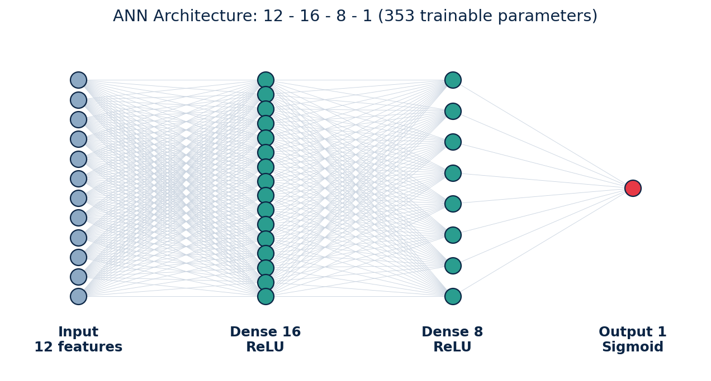

# Phishing Website Detection using Artificial Neural Network (ANN)

Mini project (Data Structures lab) – classifies a website as **Phishing** or **Legitimate** from 12 URL/domain features using a small ANN built with TensorFlow/Keras, with a Streamlit front end.

## Problem Statement
Phishing sites imitate genuine websites to steal passwords, card numbers and personal data. Blacklists are slow to update, so new sites slip through. This project trains an ANN on engineered URL/domain features to decide whether an unseen site is phishing and shows a risk report to the user.

## Dataset
- Kaggle: *Phishing Dataset for Machine Learning* – file `Phishing_Legitimate_full.csv`, **renamed to `dataset/phishing.csv`**.
- 10,000 rows (5,000 phishing + 5,000 legitimate), `id` + 48 numeric features + `CLASS_LABEL`.
- In the CSV `CLASS_LABEL`: `1 = phishing`, `0 = legitimate`. The project flips it: **0 = Phishing, 1 = Legitimate**.
- The ZIP does not contain the CSV – keep your own file in `dataset/`.

12 features used: `NumDots, SubdomainLevel, PathLevel, UrlLength, NumDash, AtSymbol, NumNumericChars, NoHttps, IpAddress, NumSensitiveWords, HostnameLength, PctExtHyperlinks`

## Model Architecture
```
Input (12) -> Dense(16, ReLU) -> Dense(8, ReLU) -> Dense(1, Sigmoid)
```
Adam optimizer · binary cross-entropy · 25 epochs · batch size 32 · 80:20 stratified split · StandardScaler (fit on train only). 353 trainable parameters.



Sigmoid output = P(Legitimate). Risk score = (1 − P) × 100 → **0–30 Low, 31–70 Medium, 71–100 High**.

## Data Structures Relevance
| Concept | Where used |
|---|---|
| Array / list | 12-value feature vector fed to the ANN; `FEATURES` list |
| String | URL analysis: length, dots, digits, `@`, `-`, IP host, sub-domains |
| Hash map (dict) | `{feature: value}` input to `predict_website()`, `FEATURE_INFO` lookup |
| CSV (tabular storage) | `phishing.csv` loaded into a DataFrame |

## Project Structure
```
Phishing-Website-Detection/
├── dataset/phishing.csv      # your renamed Phishing_Legitimate_full.csv
├── model/                    # scaler.pkl, phishing_ann.keras (created by train.py)
├── notebook/EDA.ipynb
├── src/preprocess.py         # load, null check, select, split, scale, EDA plots
├── src/train.py              # build + train ANN, metrics, confusion matrix
├── src/predict.py            # predict_website(features_dict)
├── assets/                   # generated charts and diagrams
├── app.py                    # PhishGuard AI - Streamlit entry point + sidebar navigation
├── utils/                    # UI helpers: parser.py, feature_extractor.py, insights.py, styles.py, data.py, state.py
├── views/                    # 5 pages: dashboard, scanner, security_report, analytics, about
├── .streamlit/config.toml    # dark theme
├── requirements.txt
├── report.pdf
└── presentation.pptx
```

## Installation & Run (Python 3.11)
```bash
python -m venv venv
venv\Scripts\activate            # Windows   (Linux/Mac: source venv/bin/activate)
pip install -r requirements.txt

# 1. make sure dataset/phishing.csv is your renamed Phishing_Legitimate_full.csv
python src/train.py              # preprocess + EDA plots + train + save model
python src/predict.py            # optional command-line test
streamlit run app.py             # open PhishGuard AI
```
`train.py` creates `model/scaler.pkl`, `model/phishing_ann.keras`, `assets/*.png` and `assets/metrics.json`. The Streamlit app needs these files, so train first.

Using the function directly:
```python
from src.predict import predict_website, PRESETS
print(predict_website(PRESETS["Phishing-like"]))
# {'prediction': ..., 'confidence': ..., 'risk_score': ..., 'risk_level': ...}
```
Input is a dict of the 12 raw feature values, e.g. `{"NumDots": 5, "UrlLength": 110, "AtSymbol": 1, ...}`.

## PhishGuard AI - Web UI (5 pages)
| Page | What it does |
|---|---|
| Dashboard | Hero, model stats (ANN, 12 features, dataset size, accuracy), **Scan Website** button |
| URL Scanner | Paste a URL; the 12 features are extracted automatically from the URL text |
| Security Report | Verdict, confidence %, risk meter, security score /100, checklist, URL breakdown, recommendation |
| Analytics | Class distribution, correlation heatmap, feature importance, confusion matrix |
| About | Phishing, dataset, ANN architecture, Data Structures usage |

The UI only *uses* the trained `phishing_ann.keras`, `scaler.pkl` and `predict_website()`; nothing is retrained or changed.
`utils/feature_extractor.py` builds the same 12 features from the URL string. `PctExtHyperlinks` needs the page's HTML (no scraping in this project), so the existing default value (0.1) is used for it.
Security score = 100 − risk score. Feature importance is computed on demand (permutation importance on the 20% test split).

The URL Scanner has an optional **deep scan** checkbox. Off (default), nothing is downloaded and `PctExtHyperlinks` uses the neutral default. On, `utils/fetcher.py` makes a real HTTP GET to the address (6s timeout, ~2MB cap, HTML only), parses the links with BeautifulSoup, and computes the real share of links pointing to other domains. It never retrains the model or changes the other 11 features. If the fetch fails for any reason (timeout, blocked, DNS failure, non-HTML response), it falls back to the neutral default automatically and shows why on the Security Report page.

## Screenshots (placeholders)
| Page | Screenshot |
|---|---|
| Home | `assets/screenshot_home.png` |
| URL Feature Input | `assets/screenshot_input.png` |
| Prediction Report | `assets/screenshot_report.png` |
| Analytics | `assets/screenshot_analytics.png` |

## Future Scope
- Extract the features automatically from a raw URL string.
- Compare with Random Forest / XGBoost and add more features (all 48).
- Browser extension or REST API for real-time checking.
- Model explainability (SHAP/LIME) and periodic retraining on fresh phishing feeds.
